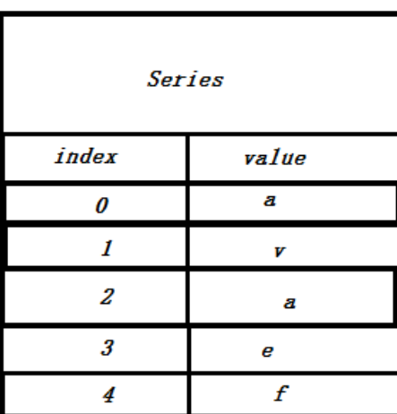
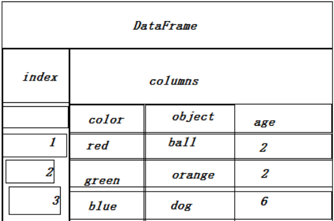
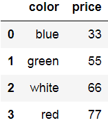
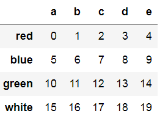
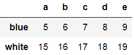
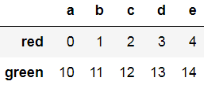
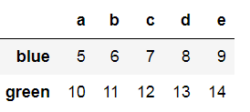
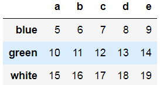
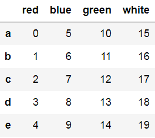

## 一：Pandas简介

​		Pandas是一个流行的开源Python程序库，其名称取panel data(面板数据，一个计量经济学的术语)与Python data analysis(Python数据分析)之意。

​       Pandas的两个最重要的数据结构为：Series和DataFrame。其中，Series用来表示一维数据结构，它的内部由两个相互关联的数组组成，其中一个数组叫做主数组用来存放数据，另一个数组用来存放索引。Series结构如图:

​           

​         DataFrame数据结构和关系型表格类似，设计的初衷是将Series的使用场景由一维扩展到多维，DataFrame的结构如图：

​         


   ## 二：Series基本操作

   + 创建Series对象

     使用Series的构造方法，把要存放在Series对象中的数据以数组形式传入

       ```python
import pandas as pd
a = pd.Series([2,4,6,8,10])
a  # 输出结果   0   2
               1   4
               2   6
               3   8
               4   10
       ```

​      也可以使用有意义的标签，用来区分和识别每个元素，比如：

```python
 b = pd.Series([1,2,3,4],index=['a','b','c','d'])
 b
```
# 输出结果
a    1
b    2
c    3
d    4
dtype: int64

+ 获取index和value

  Series对象创建好了以后，可以分别使用Series对象的index和values属性获取索引和值

  ```python
  b.index  # Index(['a', 'b', 'c', 'd'], dtype='object')
  b.values   # array([1, 2, 3, 4], dtype=int64)
  ```

+ 选择内部元素

  Series对象创建好了以后，也可以直接通过"键"或者index的方式获取Series属性值

  ```python
b[2]   # 3
b['c']  # 3
  ```

+ 获取多个元素

  + 用"键"的方式切片获取多个元素

    ```python
    b[1:3]  # 输出结果：b    2
                      c    3
    				  dtype: int64
                
    ```

  + 使用index的方式将多个index的值组成一个数组，获取多个元素

    ```python
    b[['b','d']]  # 输出结果： b    2
    						 d    4
    						 dtype: int64
    ```

+ 使用Numpy数组或其他Series对象定义新的Series对象

  ```python
  import numpy as np
  attr = np.array([33,44,55,66,77])
  t = pd.Series(attr)  # 使用Numpy数组创建新的Series对象
  t # 输出结果： 0    33
  			 1    44
  			 2    55
  			 3    66
  			 4    77
  			dtype: int32
  t2 = pd.Series(t)  # 使用Series对象定义另一个Series对象，输出结果与上面相同
  ```

  ​          需要注意的是：此时新的Series对象中的元素不是副本，而是引用，所以原Numpy数组或Series对象中元素发生变化，新的Series对象也会发生变化，反之亦然。

+ 筛选元素

  上述例子中：

  ```python
  aa = t2 > 50
  aa # 输出结果：
       0    False
  	 1    False
  	 2     True
  	 3     True
  	 4     True
       dtype: bool
  t2[aa]  # 输出结果：2      55
  				  3      66
  				  4      77
  				  dtype: int32
  ```

+ Series对象的运算和数学函数

  适用于Numpy数组的运算符或其他数学函数，也适用于Series对象

  ```python
  t2 / 2 # 输出结果：
           0      16.5
  		 1      22.0
  		 2      27.5
  		 3    4999.5
  		 4      38.5
  		 dtype: float64
  ```

  ​        注意：Series的加减乘除都是元素级别的！

  ```python
  import numpy as np
  np.log(t2)  # 输出结果：
                0    3.496508
  			  1    3.784190
  			  2    4.007333
  			  3    9.210240
  			  4    4.343805
  			  dtype: float64
  ```

  ​      注意：对于numpy库中的数学函数，必须要指定这些函数的出处，并把Series对象传入 


## 三：DataFrame基本操作

   + 定义DataFrame对象 

     ```python
     import pandas as pd
     data = {'color':['blue','green','white','red'],'price':[33,55,66,77]}
     a = pd.DataFrame(data)
     a
     # a的结果：
     ```

     

​      

​         定义DataFrame最直观、最简单的方式是在构造函数中指定三个参数：数据矩阵、index选项、columns选项。

```python
import numpy as np
a = np.arange(20).reshape((4,5))
index = ['red','blue','green','white']
columns = ['a','b','c','d','e']
df = pd.DataFrame(a,index=index,columns=columns)
df
# 输出结果
```



+ 选取元素

​       1. 获取DataFrame所有列的名称，使用columns属性

```python
 df.columns  # 结果：Index(['a', 'b', 'c', 'd', 'e'], dtype='object')
```


​       2.获取DataFrame所有index的名称，使用index属性

```python
df.index  # 结果： Index(['red', 'blue', 'green', 'white'], dtype='object')
```

   3. 获取存储在DataFrame中的元素，使用values属性

      ```python
      df.values  # 结果：array([[ 0,  1,  2,  3,  4],
             [ 5,  6,  7,  8,  9],
             [10, 11, 12, 13, 14],
             [15, 16, 17, 18, 19]])
      ```

4. 要获取某一列的内容，用列的名称检索即可

   ```python
   df['c']  # 结果：red       2
   				blue      7
   				green    12
   				white    17
   				Name: c, dtype: int32
   ```

   ​      注意：df.c也可以获取上面的结果

   5. 获取DataFrame中的行

      5.1 使用DataFrame的loc属性配合index名称，即可获取某一行的内容

      ```python
      df.loc['green']  # 结果：a    10
      						b    11
      						c    12
      						d    13
      						e    14
      						Name: green, dtype: int32
      ```

      5.2 使用DataFrame的iloc属性配合index的位置，也可获取某一行的内容

      ```python
      df.iloc[2]  # 输出结果与上面一样
      ```

      5.3 可以选取多行

      ```python
      df.loc[['blue','white']] # 通过DataFrame的loc属性选取多行 
      # 结果：
      ```

      ​        

         ```python
      df.iloc[[0,2]]  # 通过DataFrame的iloc属性选取多行
         ```
# 结果：


​       5.4  可指定索引范围来选取行：

```python
 df[1:3]
```

# 结果：


​       5.5 也可通过索引名称来选取行范围：

```python
df['blue':'white']
```

# 结果：
   

6. 获取DataFrame中的某一个值，需要依次指定元素所在的列名称，行的索引值或标签

   ```python
   df['d']['green']  # 结果：13
   df['d'][2]  # 结果也是13
   ```

   

+ 转置

  直接使用DataFrame的T属性，就可以得到一个转置矩阵

  ```python
  df.T
  # 结果
  ```

     